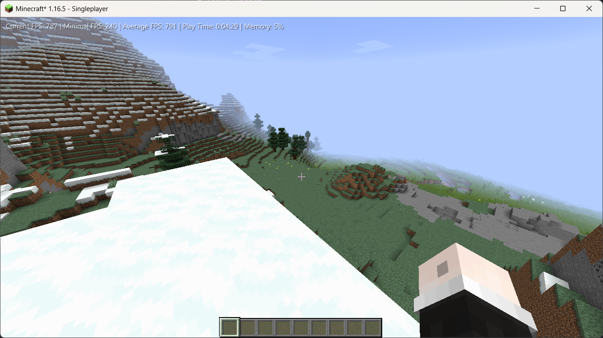
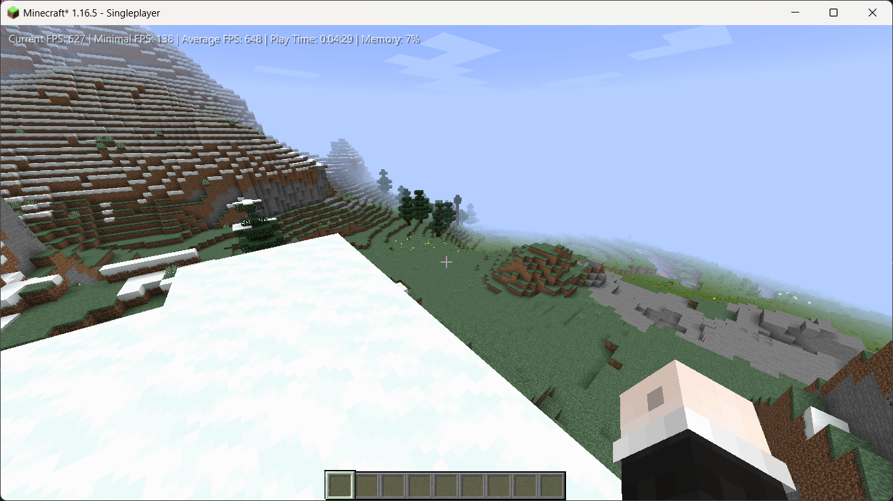

# Benchmark Info
Weather: None

Difficulty: Peaceful

Seed: -963323667424106092

Position: -139.746 102.0 -658.997

Entities and item entities have been cleared by [Cuneiform](https://www.curseforge.com/minecraft/mc-mods/cuneiform) commands /killall and /killitems

You can see my play time is 4:29 below, and in these 269 seconds, I have never moved or change my mouse too much (almost completely still).

This has been tested for three times, and the images below are from the third test.
## With Francium Installed
Average FPS: 780 ~ 800

## Without Francium Installed
Average FPS: 630 ~ 650

# Compatibility
Although there are currently no known compatibility issues, considering the slightly intrusive nature of the adjustments made by Francium, this mod may be incompatible with some other mods.

Francium has tweaked your crash report so that if there is a crash caused by this mod, the header of the crash report will have this phrase: "This crash is most likely caused by Francium, please bring this crash report with you to report it!"

# Issue Report
https://github.com/MCTeamPotato/Kasualix-Issue-Tracker